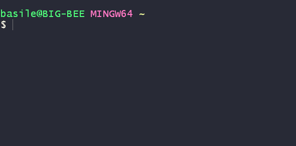
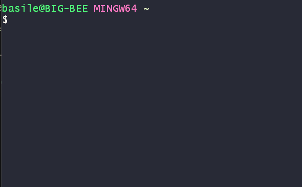

# Node: Javascript in a terminal

Before we start working on files and write some code as we are used to by now. let's first see what Node does.

**It's everywhere**

When we had installed node, we installed it globally, which means that we can access it from mostly anywhere we need within our machine.

This is also why we can use the `node --version` command anywhere in our terminal/CLI.

## What is it doing?
When we run Node, it is running a "runtime". This is where node runs on a location and keeps on running and listening for events.

When there is an event being triggered, it will receive a callback and start working. And if there is nothing, it goes to a "sleep" mode and waits for an event to be triggered.

## Running node in a terminal.
Let's try out this principle.

1. Open a terminal/CLI
2. Type: `node` + Enter

This will open a Node runtime. (see image below)

You can see that here, a runtime is being executed, but is not exiting afterwards. Instead it is staying inside this node runtime.

That is because Node comes with something called a **"REPL"**: A **R**ead-**E**val-**P**rint **L**oop.

### What can we do with this?
Well.. honestly, there are not a lot of practical advantages to using it directly in your terminal/CLI. In short: Thanks to **REPL** you can write Javascript (+ logic) in it. 

Let's see:

## Running node with files.
Although simply running a node service in the terminal is not always as practical, We can also use this `node` command to run files.

1. Open a terminal/CLI
2. Create a file called `server.js` (the name can differ, but is conventionally called "server")
3. Add a console log in your file with the string "This is a console log from my server.js file"
 
4. Type: `node server.js` +  Enter

Node will then read the file and execute it's content. Once this is done, the runtime stops.

## Done!
Now we are ready to get serious with NodeJs in the [next exercise](../README.md#exercises)! 
