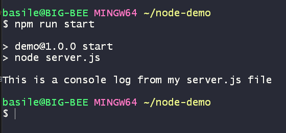
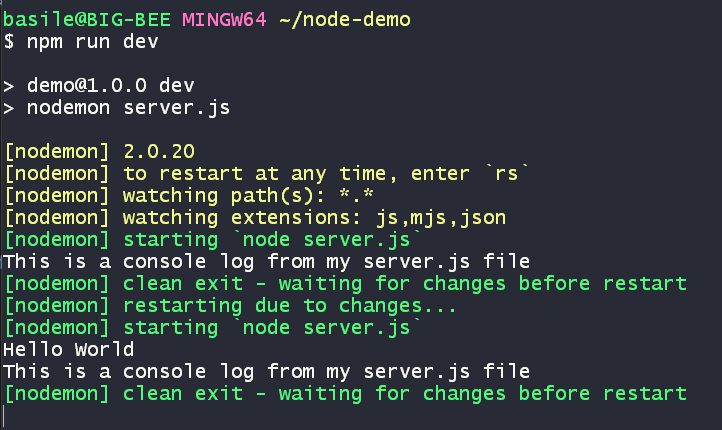

# Initializing

Go to your project folder (where we created the [server.js file](../01.Getting-started/README.md#running-node-with-files)), and initialize your `package.json` with the command `npm init`.

## Testing
By default, there is a script `test` in your `package.json` file.

1. Open your terminal/CLI and go to the path of your project
2. Instruct `npm` to `run` your script: `test`. 
```
npm run test
```

This should render the same message in your terminal/CLI as the one given next to your `test` script in your `package.json`.

## Running server.js
Now it is time to try and combine what we saw in [01.Getting-started](../01.Getting-started/README.md) and [02.A-manifest-file](../02.A-manifest-file/README.md)! 

We saw that we could manually run `server.js` by using the node command in our terminal + the filename.

What if?...

We were to add that command to a script in our `package.json`?

Let's add a script called `start` with the command to execute `node server.js`
```json
...
"scripts": {
    "test": "echo \"Error: no test specified\" && exit 1",
    "start": "node server.js"
},
...
```

Now go back to your terminal/CLI and type:
```
npm run start
```

This should result in this:

[](../_assets/npm-run-start.png)

BUT... As you can see, if you run this command, it will execute and stop once it's done.

In a **development environment**, this is **not ideal**, that would mean we need to re-execute that command each time we make a change in order to check if it works as intended.

Which brings us to our next topic:

## Running server.js in development
In order to keep our node runtime from stopping during the development of our project, we will make use of a package that will help us do exactly that.

### Nodemon (dev dependency)
First we install [nodemon](https://www.npmjs.com/package/nodemon):
```
npm i nodemon -D

#or if you have yarn

yarn add nodemon -D
```

now that we have nodemon installed, let's add a script called `dev`:

```json
...
"scripts": {
    "test": "echo \"Error: no test specified\" && exit 1",
    "start": "node server.js",
    "dev": "nodemon server.js"
},
...
```
> **NOTE**
>
> Nodemon is only recommended for development. Not for production!

Let's try out our new command. It should result in something like this:

[](../_assets/npm-run-dev.png)

As you can see, now it is not stopping the execution but keeps "watching" your file.

### Let's update something!
While your script is running with `nodemon`, go to your `server.js` and prepend a console log before your existing one:
```js
console.log("Hello Wold");
```

As you can see, nodemon is catching a change and runs automatically again!

[](../_assets/nodemon.png)


## Well done! 
Time to go to the [next exercise](../README.md#exercises)!