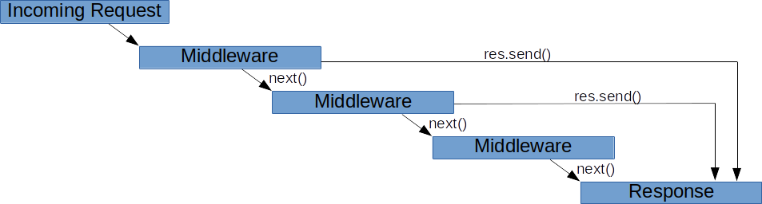
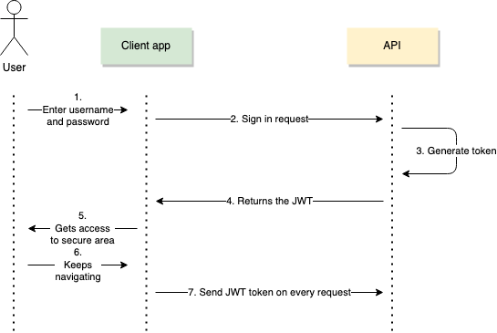

# Faster development using Express

We now know the basics of HTTP, what a request listener is, and the different type of responses we can use. However, you might notice that this way of doing things soon becomes hard to maintain.

Most Node.js developers rely on frameworks to better organize their code, Express is the most popular Node web framework, and is the underlying library for a number of other popular Node web frameworks. Node.js was released in 2009 and Express in 2010, the two are so much correlated that we can often assume that `a Node backed` = `an express-based backend`.

Express is an unopiniated framework, which means that it gives a lot of freedom to developers on how to structure their app, and since it is very minimal you'll often have to rely on other packages to build **middlewares**, for authentication, sessions, cookies, ... This also explains why there are other frameworks with far more features included, based on express, such as [Next](https://nextjs.org/), [Adonis](https://adonisjs.com/), [Nest](https://nestjs.com/), ...

## Basic setup and routing

We're going to use NPM (Node Package Manager), to install express.

Let's create a new folder, navigate in it then type:

```bash
npm i express
```

This will create a bunch of files:

- A `package.json` which will allow us to list our external dependencies and create automated scripts
- A `package-lock.json` which will link all the dependencies and find the latest compatible version between all of them, to prevent breaking changes in a package to affect the others
- A `node_modules` folder that [we should .gitignore](https://sebhastian.com/git-ignore-node_modules/), that will contain the dependencies.

Then we can create our server root, by creating an `index.mjs` file with the following content. The code below should look familiar to you.

```javascript
import express from 'express'

const PORT = 3000
const app = express()

// This is a request listener, just like in "vanilla Node"
app.get('/', (req, res) => res.send({ info: `Hello World!` }))

app.listen(PORT, () => console.log(`Server started: http://localhost:${PORT}/`))
```

The main difference with the "vanilla Node" code, is that we'll have to declare one request listener per route. **A request listener always ends when the `res.send()` method is called.**

All routes that are not declared will fall back to a `404` by default.

Adding a new route is dead simple:

```javascript
// POST request on /signup will trigger this function
app.post('/signup', (req, res) => {
  /* ... */
})
```

You can find more info on basic routing in [the official Express documentation](https://expressjs.com/en/starter/basic-routing.html)

## Advanced routing

If you read through this and thought to yourself that Express wasn't that big of a game-changer, here is where it shines.

**[Everything you need to know is in this guide](https://expressjs.com/en/guide/routing.html)**

- You can create a group of routes in a separate file, using the [Router](https://expressjs.com/en/4x/api.html#router) class.
- You can get parameters from the url, for example in `//mywebsite.com/user/4/edit` extract the `4`
- You can create [Regular expression](https://developer.mozilla.org/en-US/docs/Web/JavaScript/Guide/Regular_Expressions) based routes, for instance `app.get(/ful$/gi, (req, res) => {})` will match on `/beautiful`, `meaningful`, etc.

## Middleware

### An analogy

[Middlewares](https://expressjs.com/en/guide/using-middleware.html) are an important aspect of Express. They are part of the request-response workflow. To better understand them, imagine your backend is a candy jar:


There is this big candy jar hanging in the hall of your grandma's house, and today is you lucky day, you're allowed to take one item, and **one only**, from the jar. You've made up your mind; you want the green fuzzy gummy bear! So you put your hand in the glass container and start fetching for your sugary reward. As your hand reaches the first layers of wrapped candies and lollipop, you still keep digging because that's not what you are after. Eventually your hand reaches a known texture, it's your precious gummy bear : the request is fulfilled!

**How is that related to express?**

_A request is like your hand_, it first hits the request listener that are located on top of the file, then sequentially hits those located at the bottom until a response is returned. Middleware are just request listener with an extra argument, that we'll call `next()`. This `next()` argument is a function that will allow us to move on to the next request listener in the execution order (the one that's written below) without sending a response yet.

### Basic middleware example

The following example shows a basic use of middleware function:

```js
// This middleware being on top will be called on each request
app.use((req, res, next) => {
  console.log('The first middleware is called')
  console.log(
    `${req.method.padStart(6, ' ')} on ${
      req.url
    } at ${new Date().toISOString()}`
  )

  // We can inject a variable in the request for further use
  // in subsequent request listener
  req.someContext = 'Hello!'

  // The next method ensures we'll get to the next request listener in line
  next()
})

app.get('/', (req, res) => res.send({ info: req.someContext }))

app.get('/bye', (req, res) => res.send({ info: req.someContext }))

// If the requested url isn't either '/' or '/bye'
// this middleware will be called
app.use((req, res, next) => {
  console.log('No matching route found!')
  next()
})

app.get('*', (req, res) => res.status(404).send({ error: `Not found` }))
```

The schema of a request passing through request listeners/middlewares :



### Various types of middleware

There is a lot of potential use case for middleware functions, most are already available in express or as npm packages, among others we have:

- Logging middleware (just like the example above)
- [Static file middleware](https://expressjs.com/en/starter/static-files.html), that automatically maps every file in a directory (`public` by default) to a route. For instance, images, html/css files, browser js files, ...
- ["JSON Body parser middleware"](https://expressjs.com/en/api.html#express.json), this middleware will parse (read and interpret) the body of incoming request to use
- Cookies and sessions middleware
- Authorization middleware. Usually this middleware will be written on top of pages that are password protected. It will return a `401 Unauthorized` response if authentication has failed, or the `next()` function otherwise.

### An "almost real-life" middleware example

To illustrate the last point of the previous list, this could be the structure of a real life application. The authentication strategy may vary (session-based, token-based, [SSO](https://en.wikipedia.org/wiki/Single_sign-on), ...), but the core mechanic remains the same: we put a middleware on top of all our "protected" routes (which are only available if the user is logged in).

```js
// Allows us to parse the request body
app.use(express.json())

app.post('/api/signup', (req, res) => {
  /* Registers a user, using req.body */
})

app.post('/api/signin', (req, res) => {
  /* Logs a user in, if credentials are ok creates a session variable */
})

// All the endpoints below this middleware will require to be authenticated
app.use((req, res, next) => {
  if (!your.authentication.strategy.userLogin /* up to you */)
    return res
      .status(401)
      .send({ error: 'You need to log in to access this endpoint' })

  next()
})

app.get('/api/users', (req, res) => {
  /* Displays a list of user */
})

app.get('/api/posts', (req, res) => {
  /* Displays a list of post */
})

// ...
```

## Authentication using JSON Web Tokens

JSON Web Tokens (or JWT in short) is one of the way to ensure authentication from an API to a client. Tokens are issued by the server using a unique private key (called a `secret`) which ensures that the user have succesfully logged in. **Anyone can read the content of the token**, but you cannot create your own token unless you know the secret: it is extremely important to keep this secret ... well, secret ... and to never push it on your repository!

A token has an expiry date after which it will no longer be valid, **it cannot be revoked** so it is important to **keep that expiry date as short as possible**.

This system is a very convenient way to store **stateless**, **cryptographically verified**, information. But it is important to understand its underlying mechanism and pitfalls beforehand.

### The authentication flow



Implementing authentication using JWT is quite straightforward. Say you want to do a traditional login+password authentication with some user information stored in the DB.

1. A user sends their credentials (using a form for example).
1. The server receives the credentials. If the username and password match the record stored in the db, the server generates a token containing the user's name and their id for instance (you can store anything you'd like in a token, but remember that anyone can read its content, so do not store any sensitive information!)
1. The server sends back the token to the client. The usual way of dealing with tokens in the client, is to store the information in a cookie.
1. Once the token is stored on the client side, it is sent on every request (using the [`Authorization` request header](https://developer.mozilla.org/en-US/docs/Web/HTTP/Headers/Authorization)).
1. If a route needs the user to be logged in, the request will first pass through a middleware that verifies the token authenticity.

### Pros of JWT

- Tokens are stateless. Unlike sessions there is no need to store tokens on the server, once they're signed, they are proven to be issued from your server. This means your server can crash it'll still be valid.
- You can decentralize authentication on another server, the only thing you need in order to do that is to share your secret between your instances. But it does not matter which server issued the token as long as they have the same private key to be verified.
- Tokens hold information in plain sight, it's easy to debug since you can access the content of your token as a client.
- It's up to you to choose how to deliver tokens. For instance: you can easily create passwordless authentication (by sending the token in a url query parameter, via an email), so you don't even have to store passwords on your server.

### Cons of JWT

The JWT system comes with a few pitfalls however.

- Since tokens only contain stateless information, grabbing someone else's token means easy impersonation. For this reason, and because tokens are practically irrevocable it is important to keep their expiration date as short as possible
- Tokens are cryptographically signed, it is important to use a strong enough secret and cryptographic algorithm to generate them.

### A simple implementation

Most tutorials will refer to external services or library to handle authentication. Although it is usually not recommended to craft your own auth system for real production application because of all the possible security breach you should be aware of, it is a good exercise to code such system for a learning purpose.

Your implementation should use the [jsonwebtoken NPM package](https://www.npmjs.com/package/jsonwebtoken), specifically the `sign()` and `verify()` method.

- Create a strong secret key, and put it in an [gitignored `.env` file](https://www.npmjs.com/package/dotenv)
- Create a `POST` route in which you send an email. Inside that route create a token using the `JWT.sign` method, that contains the email, and sign it using your secret key.
- Create a middleware to validate the token, using the `JWT.verify` method.
- Create a token-protected route by using your middleware. To access this route the user should add their token in their `Authorization` request header.
