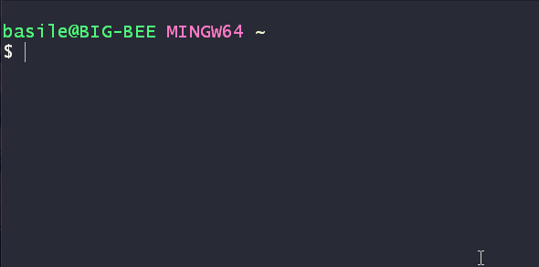

# Installing NodeJs

## Do I already have it?
To check if you already have Nodejs, you can use a simple command:

1. Open your terminal or command line interface
2. Type in `node --version` or `node -v`

This should return a version if you already have node installed.

## I don't have it yet!
 The steps to install node are pretty simple, 
 Visit the website : [NodeJs](https://nodejs.org/en/)
 1. Choose a version:
    * **LTS** (recommended): Long Term Support - A steady version that will be supported until a new LTS comes along. even when there are newer functions, the LTS is still more recommended since it is a stable version.
    * **Current**: Current version - The last deployed version. It has the latest changes, which can result in not being completely "battle tested".
2. Follow the default options when installing. and click install.
3. check if it is correctly installed by checking for it's version (see [Check Version](#do-i-already-have-it))

## A package manager

In node, almost every time, we will have to use packages or libraries. this means that they will need to be installed as well. to install packages and libraries, we make use of a **Package manager**. 

When installing node it should automatically have installed a package manager called **Node package manager** or **NPM** as well.

Let's see if we have it!
* in your terminal/command line interface, type: `npm --version` or `npm -v`

## All done!
Let go [back](../README.md#before-we-start)